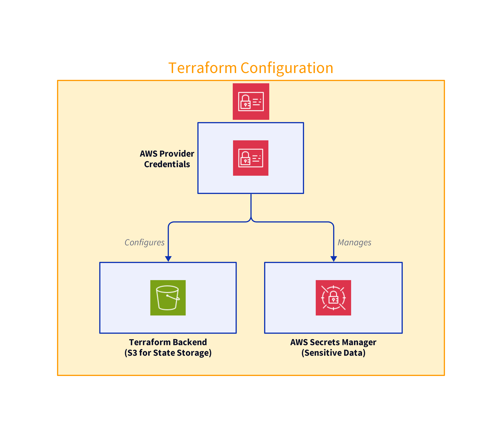

# Setting Up Terraform with AWS: A Beginner's Guide

In this comprehensive guide, we'll explore how to set up Terraform to work seamlessly with AWS. From configuring AWS provider credentials to managing sensitive data and understanding the basic structure of a Terraform project, you'll learn everything you need to get started. Additionally, we'll delve into backend configurations for remote state storage and integrate AWS Secrets Manager for enhanced security.


## Introduction to Terraform and AWS

Terraform is an open-source infrastructure as code software tool created by HashiCorp. It allows users to define and provision data center infrastructure using a high-level configuration language known as HashiCorp Configuration Language (HCL), or optionally JSON.

AWS (Amazon Web Services) is a comprehensive, evolving cloud computing platform provided by Amazon that includes a mixture of infrastructure as a service (IaaS), platform as a service (PaaS), and packaged software as a service (SaaS) offerings.

### Why Use Terraform with AWS?

  - Automation and Efficiency: Terraform can automate the deployment of infrastructure, making the process more efficient and error-free compared to manual provisioning.
  - Scalability: With Terraform, scaling your infrastructure up or down based on demand becomes a straightforward task.
  - Version Control: Infrastructure as code (IaC) enables version control for your infrastructure, allowing you to track changes and revert to previous states if necessary.

# Configuring AWS Provider Credentials

Before you can use Terraform with AWS, you need to configure your AWS provider credentials. This allows Terraform to interact with your AWS account to create, update, and delete resources.
Creating an IAM User

  1. Log in to your AWS Management Console.
  2. Navigate to the Identity and Access Management (IAM) page.
  3. Create a new IAM user with programmatic access. This will provide you with an access key ID and a secret access key.

## Configuring the AWS Provider in Terraform

```yaml
provider "aws" {
  region     = "us-east-1"
  access_key = "your_access_key_here"
  secret_key = "your_secret_key_here"
}
```

Note: It's recommended to use environment variables (AWS_ACCESS_KEY_ID and AWS_SECRET_ACCESS_KEY) for your keys to keep them secure.

## Basic Structure of a Terraform Project

A typical Terraform project contains the following files:

  - main.tf: This file contains the main set of configuration code.
  - variables.tf: Here, you can declare variables to make your configuration more dynamic and reusable.
  - outputs.tf: This file is used to define outputs from your Terraform state.

```yaml
# main.tf
resource "aws_s3_bucket" "my_bucket" {
  bucket = "my-unique-bucket-name"
  acl    = "private"
}

# variables.tf
variable "region" {
  description = "The AWS region"
  default     = "us-east-1"
}

# outputs.tf
output "bucket_name" {
  value = aws_s3_bucket.my_bucket.id
}
```

## Backend Configurations for Remote State Storage

Terraform stores state information about your managed infrastructure and configuration. This state can be stored remotely, which is essential for team collaboration and for keeping sensitive information secure.
Configuring an S3 Backend

```yaml
terraform {
  backend "s3" {
    bucket = "my-terraform-state-bucket"
    key    = "state"
    region = "us-east-1"
  }
}
```

This configuration stores the Terraform state in an S3 bucket, allowing it to be shared among a team and providing a backup of this critical information.

## Managing Sensitive Data with Terraform

Sensitive data, such as passwords or access keys, should never be hard-coded into your Terraform configuration files.

### Using AWS Secrets Manager

AWS Secrets Manager helps you protect access to your applications, services, and IT resources without the upfront cost and complexity of managing your own infrastructure for secret management.

#### Integrating AWS Secrets Manager with Terraform

```yaml
data "aws_secretsmanager_secret_version" "my_secret" {
  secret_id = "my_secret_name"
}

resource "aws_db_instance" "my_database" {
  # other configuration...
  password = data.aws_secretsmanager_secret_version.my_secret.secret_string
}
```

This code snippet retrieves a secret from AWS Secrets Manager and uses it to set the password for a database instance, keeping the sensitive information secure.

## Conclusion

Setting up Terraform with AWS provides a powerful combination to manage your infrastructure as code, making it more efficient, scalable, and secure. By following the best practices outlined in this guide, such as using AWS Secrets Manager for sensitive data and configuring remote state storage, you can ensure a robust and secure infrastructure setup. With these foundational concepts, you're now ready to explore more advanced Terraform features and further enhance your infrastructure management strategy.

# Architecture Diagram
