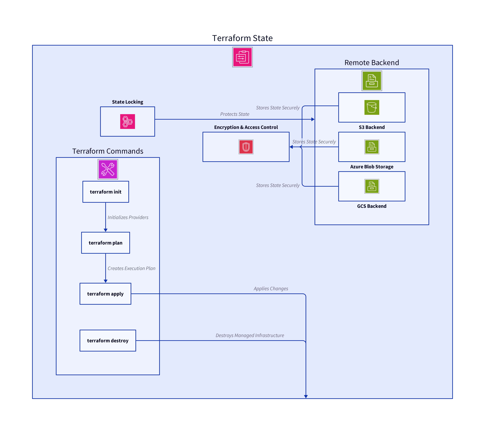

# 🧮 Managing Terraform State: Best Practices and Security

Terraform, a widely used infrastructure as code tool, allows for the automation of infrastructure provisioning across multiple service providers. Central to Terraform's functionality is the concept of "state," a crucial component that tracks the state of your infrastructure and configuration. This document aims to educate beginners on the importance of Terraform state, how it's managed, and strategies for securely handling state files, including state locking, state file storage, and the use of remote backends.

## 🔬 Understanding Terraform State

Terraform state is a JSON file that Terraform generates automatically during the `terraform apply` command. This file contains vital information about the resources Terraform creates, allowing Terraform to map real-world resources to your configuration and keep track of metadata.



### Why is State Important?

  - Synchronization: It ensures that Terraform's actions are based on the most current information about your infrastructure, preventing conflicts.
  - Dependency Resolution: Terraform uses the state to determine the order in which resources should be created, updated, or deleted.
  - Inspection: Users can query the state to inspect Terraform-managed infrastructure without accessing the cloud provider's console or API.

# 🎋 Managing State Files

Terraform state can be managed locally or remotely, each with its own set of considerations for security and collaboration.

## Local State Management

By default, Terraform stores state locally in a file named terraform.tfstate. While this is simple and convenient for individual use, it poses challenges for team collaboration and security.

```yaml
terraform {
  backend "local" {
    path = "relative/path/to/terraform.tfstate"
  }
}
```

## Remote State Management

For teams and projects requiring collaboration, remote state backends like AWS S3, Azure Blob Storage, or Google Cloud Storage are recommended. Remote backends offer several advantages:

  - Shared Access: Team members can access the state concurrently, allowing for collaborative work on infrastructure.
  - Security: Remote backends can be secured with encryption, access controls, and other cloud-provider security features.
  - State Locking: Prevents concurrent state operations, reducing the risk of corruption.

### Example: Configuring an S3 Backend

```yaml
terraform {
  backend "s3" {
    bucket         = "my-terraform-state-bucket"
    key            = "path/to/my/terraform.tfstate"
    region         = "us-east-1"
    encrypt        = true
    dynamodb_table = "my-lock-table"
  }
}
```

This configuration stores the state in an encrypted form in an S3 bucket and uses a DynamoDB table for state locking.

# 🔐 State Locking

State locking is crucial for preventing multiple users from making simultaneous changes to the state, which can lead to conflicts or corruption. Terraform automatically locks the state for all operations that could write state, such as `terraform apply` or `terraform destroy`.

## How State Locking Works

When Terraform needs to lock the state, it creates a lock in the configured backend. If another operation tries to modify the state while it's locked, Terraform will wait for the lock to be released or fail after a timeout.

# 🧰 Security Considerations for State Files

State files can contain sensitive information, such as passwords or access keys. Therefore, securing state files is paramount.
Strategies for Securing State Files

  - Encryption: Always use backends that support encryption at rest.
  - Access Control: Limit access to the state files using IAM roles or similar mechanisms.
  - Regular Auditing: Periodically review access logs and permissions to ensure that only authorized users can access the state files.

# 🧾 Common Issues and Best Practices

## Common Issues

  - State Drift: This occurs when manual changes are made to the infrastructure outside of Terraform, causing the state to be out of sync.
  - Large State Files: These can slow down Terraform operations and increase the risk of timeouts or errors.

## Best Practices

  - Regularly Review State Files: Use `terraform plan` to detect and address drift.
  - State File Optimization: Break down large configurations into smaller, manageable modules to keep state files lean.
  = Secure State Files: Apply encryption, access controls, and monitor access patterns.

# 🎉 Conclusion

Effective state management is critical for the successful use of Terraform at scale. By understanding and implementing the practices outlined in this document, users can ensure their infrastructure is managed securely and efficiently. Whether you're working solo or as part of a large team, these strategies will help you leverage Terraform's capabilities while minimizing risks associated with state management.

# 🧐 What's Next?

When you are ready, click on the Tasks tab at the top to get started with the hands-on labs. Here, you will learn about Terraform state in depth with AWS which will enable you to effectively manage your state.