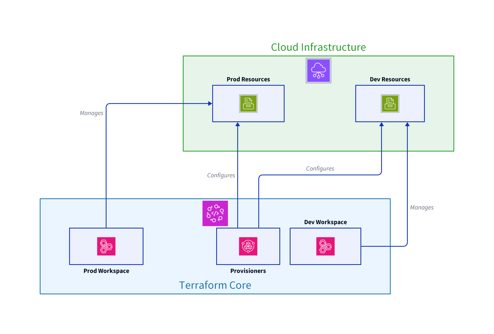

⛳ Advanced Features of Terraform: Workspaces, Provisioners, and Data Sources

Terraform is a powerful tool for building, changing, and versioning infrastructure safely and efficiently. This guide delves into few of its more advanced features: workspaces, provisioners and data sources. Also, you will get briefly acquainted with HCP terraform, formerly Terraform Cloud.

Designed for beginners, this document explains how to manage multiple environments with workspaces, utilize provisioners for post-deployment tasks and use data sources to reference some attributes of non-terraform resources, incorporating clear examples and simple analogies to aid understanding.

🔰 Terraform Workspaces

Imagine you're an artist with a single canvas, but you wish to paint different scenes without mixing them up. Terraform workspaces serve a similar purpose in managing distinct instances of your infrastructure with ease, akin to having multiple canvases.
Understanding Workspaces

A Terraform workspace is a named container that holds a separate state for your infrastructure. By default, Terraform operates in a workspace named default. However, you can create multiple workspaces to manage different environments (e.g., development, staging, production) without the risk of interfering with each other.
Creating and Managing Workspaces

To start using workspaces, you first need to understand how to create and manage them. Here's a step-by-step guide:
Creating a New Workspace

terraform workspace new dev

This command creates a new workspace named dev. Terraform will automatically switch to this workspace upon creation.
Listing Workspaces

terraform workspace list

This will list all workspaces, with the current workspace highlighted.
Switching Workspaces

terraform workspace select dev

Switch to the dev workspace with this command.
Using Workspaces in Configuration

To leverage the power of workspaces within your Terraform configurations, you can use the ${terraform.workspace} interpolation. This allows for dynamic changes based on the current workspace. For example:

resource "aws_s3_bucket" "example" {
  bucket = "my-app-${terraform.workspace}"
  acl    = "private"
}

In the dev workspace, this configuration will create an S3 bucket named my-app-dev.
🔩 Terraform Provisioners

After Terraform creates your resources, you might want to perform additional tasks like running a script or configuring a service. Provisioners in Terraform are your tools for these post-deployment activities.
Understanding Provisioners

Think of provisioners as the crew that comes in after a building is constructed to paint the walls and install the carpets. They're the final touch that makes the space usable.
Types of Provisioners

    Local-exec: Executes a command on the machine running Terraform.
    Remote-exec: Executes a command on the newly created resource.

Using the Local-exec Provisioner

The local-exec provisioner can be used to run scripts on your local machine after a resource is created. For example, to send a notification:

resource "aws_instance" "example" {
  # ...

  provisioner "local-exec" {
    command = "echo 'New instance created' > instance_creation.txt"
  }
}

Using the Remote-exec Provisioner

The remote-exec provisioner allows you to run commands on a remote resource after it's been created. This requires connection details:

resource "aws_instance" "example" {
  # ...

  provisioner "remote-exec" {
    inline = [
      "sudo apt-get update",
      "sudo apt-get install -y nginx",
    ]

    connection {
      type        = "ssh"
      user        = "ubuntu"
      private_key = file("~/.ssh/id_rsa")
      host        = self.public_ip
    }
  }
}

Best Practices for Using Provisioners

    Idempotency: Ensure your scripts can run multiple times without causing errors or unintended consequences.
    Minimal Use: Provisioners should be a last resort. Prefer using other Terraform resources or data sources if possible.

🌟 Data Sources

Data sources are used to retrieve information about existing resources or external systems that are not managed by Terraform. They allow you to query and reference this data within your Terraform configurations.

For example, if you need to use the latest Amazon Linux AMI for your EC2 instances but don't manage the AMI directly, you can use a data source to fetch this information. Here's a concise example:

data "aws_ami" "latest_amazon_linux" {
  owners      = ["amazon"]
  most_recent = true
  filters {
    name   = "name"
    values = ["amzn2-ami-hvm-*-x86_64-gp2"]
  }
}

resource "aws_instance" "example" {
  ami           = data.aws_ami.latest_amazon_linux.id
  instance_type = "t2.micro"
}

⛅ HCP Terraform

HashiCorp Cloud Platform (HCP) Terraform is a service provided by HashiCorp that simplifies the management of Terraform infrastructure by offering a managed Terraform Cloud environment. It allows you to securely and efficiently run Terraform workflows without needing to manage the infrastructure yourself.
Key Features:

Managed Infrastructure: HCP Terraform handles the underlying infrastructure for running Terraform, including scaling and high availability.
Secure Storage: Provides secure storage for state files and sensitive data, reducing the risk of data loss or exposure.
Integrated Secrets Management: Integrates with HashiCorp Vault for managing secrets and sensitive data.
Collaboration: Facilitates team collaboration with features like version control, access management, and remote state management.
🎉 Conclusion

Terraform's workspaces and provisioners are powerful features that, when used correctly, can significantly enhance your infrastructure management and automation capabilities. Workspaces allow for seamless management of multiple environments, while provisioners offer the flexibility to perform necessary actions on your resources post-deployment. By understanding and applying these features, you can take your Terraform projects to the next level.
🎓 What's Next?

In this lab, we will walk you through configuring advanced terraform features on AWS, leveraging features such as workspaces, provisioners and da.
Click on the Tasks tab to put your knowledge to the test and complete the hands-on exercises for this lab.
Happy learning! 🚀