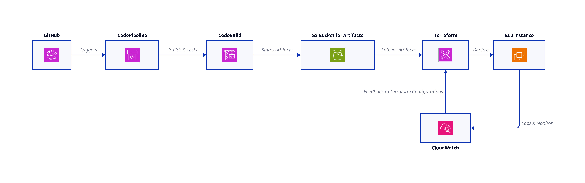

# 🔨 Automating AWS Infrastructure Deployments with Terraform and CI/CD Integration

Deploying and managing infrastructure manually in the cloud can be time-consuming and prone to errors. Automation tools like Terraform, combined with Continuous Integration/Continuous Deployment (CI/CD) pipelines, can significantly streamline this process.

This guide will walk you through automating AWS infrastructure deployments using Terraform and integrating this process into a CI/CD pipeline with AWS CodePipeline.

# 🔰 Introduction to Terraform and CI/CD

Before diving into the specifics, let's briefly understand what Terraform and CI/CD are and how they contribute to infrastructure management and automation.

## 🏴 Terraform

Terraform is an open-source Infrastructure as Code (IaC) tool developed by HashiCorp. It allows you to define your infrastructure using a high-level configuration language. Terraform uses this configuration to create an execution plan that outlines what it will do to reach the desired state and then executes it to build the described infrastructure.

## 🏴 Continuous Integration/Continuous Deployment (CI/CD)

CI/CD is a method to frequently deliver apps to customers by introducing automation into the stages of app development. The main concepts attributed to CI/CD are continuous integration, continuous delivery, and continuous deployment. CI/CD pipelines are designed to mitigate the risks in software delivery process, automate steps, and improve productivity and quality.

# 🧾 Integrating Terraform with AWS CodePipeline

AWS CodePipeline is a fully managed continuous delivery service that helps automate release pipelines for fast and reliable application and infrastructure updates. Integrating Terraform with AWS CodePipeline allows you to automate the deployment and management of your AWS infrastructure.



## 🔧 Setting Up the Environment

To start, you need an AWS account, Terraform installed on your local machine, and the AWS CLI configured.

Below is an overview for these steps, however, you don't need to try it in the terminal as both Terraform and AWS are already present.
### Install Terraform

```bash
# Download the Terraform binary
wget https://releases.hashicorp.com/terraform/0.14.9/terraform_0.14.9_linux_amd64.zip

# Extract the binary
unzip terraform_0.14.9_linux_amd64.zip

# Move the binary to your PATH
sudo mv terraform /usr/local/bin/
```

### Configure AWS CLI

```bash
# Configure AWS Access
aws configure
```

Enter your AWS Access Key ID, Secret Access Key, and default region when prompted.

# ✍ Creating a Terraform Configuration

Create a new directory for your Terraform configuration and initialize a Terraform project.

```bash
mkdir terraform-aws-deployment
cd terraform-aws-deployment
terraform init
```

Create a file named `main.tf` and add your AWS resource configuration. For example, to create an S3 bucket:

```bash
provider "aws" {
  region = "us-east-1"
}

resource "aws_s3_bucket" "my_bucket" {
  bucket = "my-unique-bucket-name"
  acl    = "private"
}
```

# 📝 Setting Up AWS CodePipeline

  1. Create a GitHub Repository: Store your Terraform configuration in a GitHub repository. This will be used as the source stage for your pipeline.
  2. Create a BuildSpec File: AWS CodeBuild uses a build specification (`buildspec.yml`) to run build commands. Create a `buildspec.yml` in your repository root that defines the build commands and configurations used by CodeBuild.

```bash
version: 0.2

phases:
  install:
    commands:
      - wget https://releases.hashicorp.com/terraform/0.14.9/terraform_0.14.9_linux_amd64.zip
      - unzip terraform_0.14.9_linux_amd64.zip
      - mv terraform /usr/local/bin/
  pre_build:
    commands:
      - terraform init
  build:
    commands:
      - terraform apply -auto-approve
```
  3. Create a CodePipeline: Use the AWS Management Console to create a new pipeline. Select GitHub as the source provider and connect to your repository. For the build stage, select AWS CodeBuild and provide the `buildspec.yml` file. The deploy stage can be skipped since Terraform will handle the deployment.

## 🧮 Automating Deployments

Once the pipeline is set up, any commit to the repository will trigger the pipeline. The pipeline will execute the Terraform commands defined in `buildspec.yml`, applying your infrastructure changes automatically.

# 💯 Best Practices for Terraform and CI/CD Integration

  - Use Remote State: Store your Terraform state file in a remote backend like S3 to share state across your team and prevent conflicts.
  - Implement Workspaces: Use Terraform workspaces to manage separate environments (e.g., development, staging, production) within the same configuration.
  - Secure Secrets: Use tools like AWS Secrets Manager or HashiCorp Vault to manage secrets and sensitive information. Avoid hardcoding secrets in your Terraform configuration or `buildspec.yml`.
  - Review Pull Requests: Implement a code review process for changes to your Terraform configuration to ensure quality and compliance.

# 🎉 Conclusion

Congratulations! You've successfully integrated Terraform with AWS CodePipeline.

Integrating simplifies and automates the process of deploying and managing AWS infrastructure.

By following the steps and best practices outlined in this guide, you can achieve consistent and repeatable infrastructure changes, reduce manual errors, and improve the efficiency of your deployment processes.

# 🎓 What's Next?

In this lab, we will walk you through creating your own CI/CD pipeline using Terraform and AWS codepipeline. Click on the Tasks tab to put your knowledge to the test and complete the hands-on exercises for this lab. Happy learning! 🚀